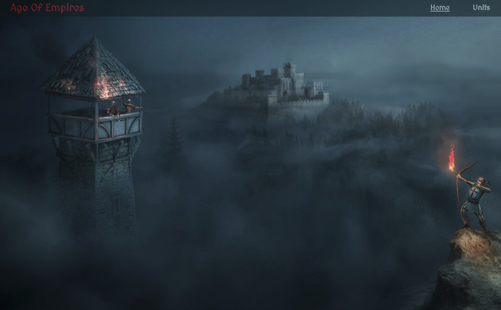
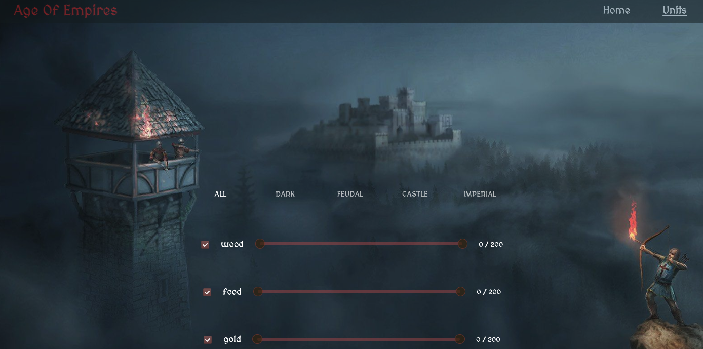
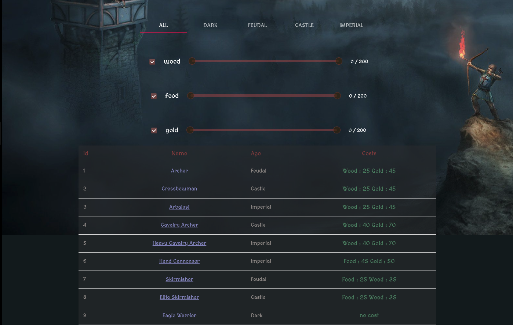
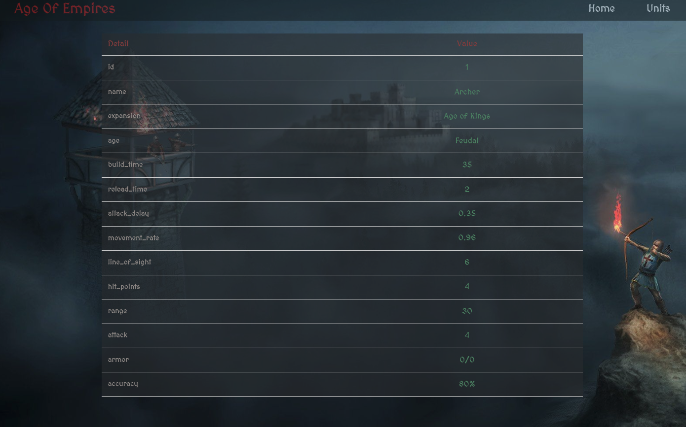

# AGE OF EMPIRES - UNIT- WIKI (AZAT SEYREK)

<h1 align="center">⚡ AGE OF EMPIRES WIKI ⚡</h1>

DEMO : <a href="http://azatsyerek-ageof.surge.sh/">Demo Link</a>

This is Age of Empires app built on  ReactJS

<h2 align="center">Project Details </h2>

- You can filter costs ("wood", "food", "gold")
- You can easily make your search with Slider.
- You can review the unit details

<h2 align="center">Technologies</h2>

- ReactJS
- Redux
- Redux-Saga
- SASS
- MUI

# Project images

DEMO : <a href="http://azatsyerek-ageof.surge.sh/">Demo Link</a>
